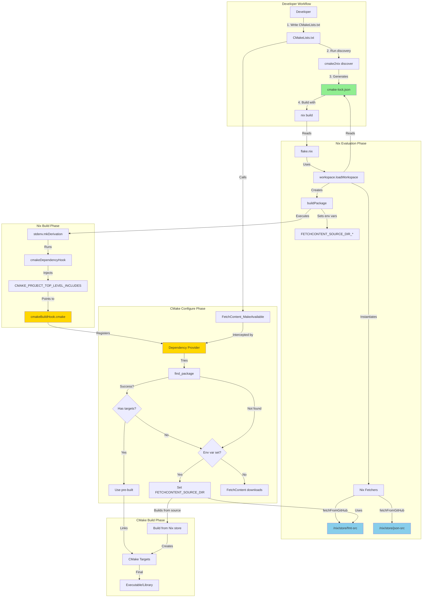
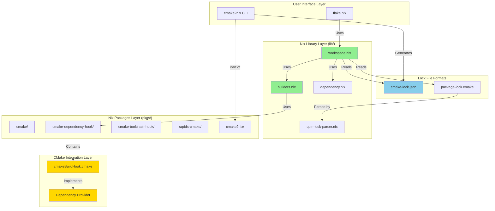
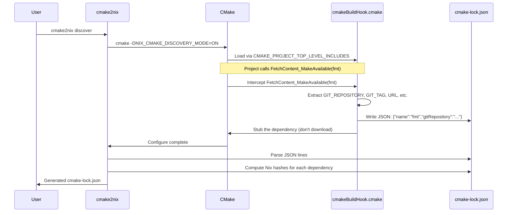
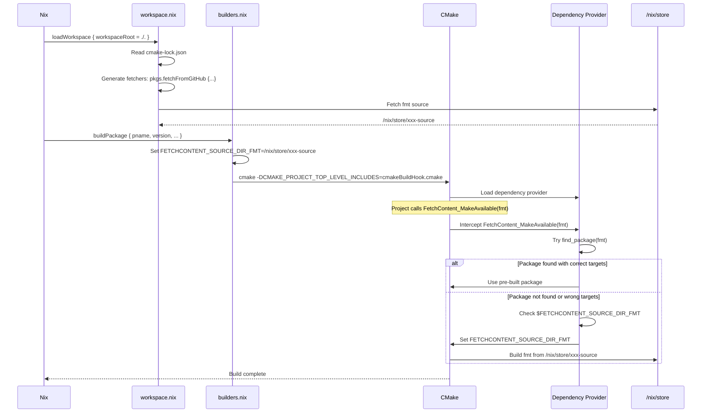
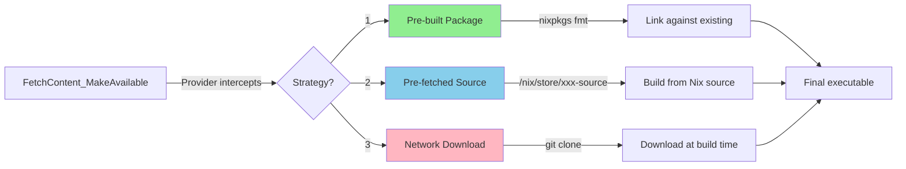
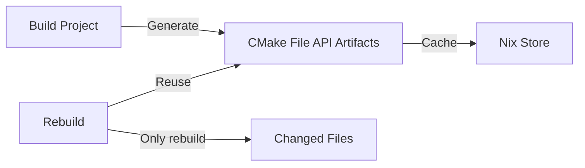

# Technical Architecture

`nix-cmake` bridges the gap between CMake's dynamic dependency management and Nix's static, sandboxed environment.

## System Overview



## Component Diagram



## Dependency Provider Hook

The core mechanism is using CMake's `CMAKE_PROJECT_TOP_LEVEL_INCLUDES` feature (available in CMake 3.24+) to inject a "Dependency Provider". This follows the pattern used by tools like Conan's CMake integration.

### Interception Logic
The hook intercepts:
- `FetchContent_MakeAvailable()` and `FetchContent_Populate()`
- `find_package()`, ensuring it looks in Nix's `CMAKE_SYSTEM_PREFIX_PATH` first.
- `CPMAddPackage()` (which internally uses FetchContent).

When a dependency is requested, the provider checks if a Nix-provided source directory is available in the environment or specified in a lock file. If found, it marks the dependency as "populated" and directs CMake to the local Nix store path, bypassing the network download.

## Unpatched CMake (Zero-Patch Philosophy)

A primary goal of `nix-cmake` is to show that a standard, unpatched Kitware CMake release can work effectively in Nix.
- We use an in-tree `cmakeMinimal` (CMake 4.2.1) without the typical Nixpkgs patches.
- We rely on declarative toolchain files and dependency providers instead of hardcoding Nix-specific paths into the CMake source code.

### Avoiding Impure System Paths

Instead of patching hundreds of lines in CMake's Find modules (as nixpkgs does), we use CMake's built-in `CMAKE_SYSTEM_IGNORE_PREFIX_PATH` variable to ignore impure system locations:

```cmake
CMAKE_SYSTEM_IGNORE_PREFIX_PATH=/usr;/usr/local;/opt;/Library;/System/Library;...
```

This tells CMake's `find_package()`, `find_library()`, `find_file()`, and `find_path()` commands to skip these directories. Benefits:

- **Zero patches**: Works with stock Kitware CMake
- **Maintainable**: No need to update patches for each CMake release
- **Hermetic**: Prevents accidental usage of system libraries
- **Explicit**: Clear declaration of what we're ignoring

### Runtime Tool Dependencies

Instead of patching CMake source to hardcode tool paths (as nixpkgs does), we use `wrapProgram` to ensure runtime dependencies are available in `PATH`:

```nix
postInstall = ''
  for prog in cmake ctest cpack; do
    wrapProgram "$out/bin/$prog" \
      --prefix PATH : ${lib.makeBinPath ([
        git ps sysctl
      ] ++ lib.optionals stdenv.hostPlatform.isDarwin [
        darwin.DarwinTools    # sw_vers
        darwin.system_cmds    # vm_stat
      ])}
  done
'';
```

This ensures CMake can find tools like `git`, `ps`, `sysctl`, and macOS-specific tools without source patches.

### Other Impurities Handled via Variables

We also handle other impurities using CMake's built-in configuration:
- `CURL_CA_BUNDLE=${NIX_SSL_CERT_FILE}` - SSL certificates
- `CPM_USE_LOCAL_PACKAGES=ON` - CPM.cmake integration

See [ZERO-PATCH.md](./ZERO-PATCH.md) for detailed comparison with nixpkgs' patching approach.

## Data Flow: Discovery Phase



### Recursive Discovery (FOD-based)

To handle project trees where dependencies are only known after the top-level project is configured, we use a **Fixed-Output Derivation (FOD)** discovery pass.

1. **Guest Configure**: CMake runs in a derivation where network access is allowed (FOD).
2. **Interception Logging**: The dependency provider logs every `FetchContent` call to a structured JSON file.
3. **File API Extraction**: We query the CMake File API to get a complete model of all targets, including those from nested subprojects.
4. **Nix Model**: The resulting JSON log and File API replies are parsed by Nix to build a complete dependency graph.

## Data Flow: Build Phase



## Environment Variable Contract

For simple use cases, dependencies can be provided directly via environment variables:

```bash
export FETCHCONTENT_SOURCE_DIR_FMT=/nix/store/...-fmt-src
```

The hook reads these and satisfies the `FetchContent_MakeAvailable(fmt)` call automatically.

## Component Details

### 1. cmake2nix CLI (`pkgs/cmake2nix/`)

**Purpose**: User-facing tool for dependency discovery and lock file generation.

**Key Functions**:
- `discover`: Run CMake in discovery mode, collect dependencies, compute hashes
- `lock`: Generate cmake-lock.json from discovery output
- Future: `update`, `add`, `remove` for lock file management

### 2. workspace.nix (`lib/workspace.nix`)

**Purpose**: High-level API for CMake projects (similar to uv2nix).

**Key Functions**:
- `loadWorkspace { workspaceRoot }`: Auto-reads cmake-lock.json or package-lock.cmake
- `buildPackage`: Build a CMake package with dependencies from lock file
- `discoverDependencies`: Run discovery mode to find dependencies
- `mkShell`: Create development shell with all dependencies

**Architecture**:
```nix
loadWorkspace = { workspaceRoot }:
  let
    # 1. Auto-detect and read lock file
    lock =
      if (exists cmake-lock.json) then readJSON cmake-lock.json
      else if (exists package-lock.cmake) then parseCPMLock
      else { dependencies = {}; };

    # 2. Instantiate all fetchers from lock file
    fetchers = mapAttrs (name: dep:
      pkgs.${dep.method} dep.args  # e.g., pkgs.fetchFromGitHub { ... }
    ) lock.dependencies;

    # 3. Return workspace with buildPackage, mkShell, etc.
  in { buildPackage, mkShell, ... };
```

### 3. builders.nix (`lib/builders.nix`)

**Purpose**: Low-level build functions for CMake packages.

**Key Functions**:
- `buildCMakePackage`: Core builder that sets up environment variables
- `buildDepsOnly`: Build only dependencies (for caching)

**Architecture**:
```nix
buildCMakePackage = { fetchContentDeps, ... }:
  let
    # Convert fetchers to FETCHCONTENT_SOURCE_DIR_* env vars
    fetchContentEnv = mapAttrs' (name: src:
      nameValuePair "FETCHCONTENT_SOURCE_DIR_${toUpper name}" "${src}"
    ) fetchContentDeps;
  in
  stdenv.mkDerivation (args // fetchContentEnv // {
    nativeBuildInputs = [ cmake ninja cmakeDependencyHook ];
    cmakeFlags = [ "-GNinja" ];
  });
```

### 4. cmakeBuildHook.cmake (`pkgs/cmake-dependency-hook/cmakeBuildHook.cmake`)

**Purpose**: CMake-side integration that intercepts FetchContent calls.

**Key Mechanisms**:

#### 4a. Dependency Provider Registration
```cmake
cmake_language(
  SET_DEPENDENCY_PROVIDER nix_dependency_provider
  SUPPORTED_METHODS FETCHCONTENT_MAKEAVAILABLE_SERIAL FIND_PACKAGE
)
```

#### 4b. Discovery Mode
```cmake
if(NIX_CMAKE_DISCOVERY_MODE)
  # Log dependency info as JSON
  file(APPEND "${_discovery_log}"
    "{\"name\":\"fmt\",\"gitRepository\":\"...\",\"gitTag\":\"...\"}\n")

  # Stub the dependency to prevent downloads
  FetchContent_SetPopulated(fmt SOURCE_DIR "/stub" BINARY_DIR "/stub")
endif()
```

#### 4c. Build Mode with Pre-built Packages
```cmake
# Try find_package first
find_package(${dep_name} BYPASS_PROVIDER QUIET GLOBAL)

if(${dep_name}_FOUND AND has_expected_targets)
  # Use pre-built package from nixpkgs
  FetchContent_SetPopulated(${dep_name} ...)
endif()
```

#### 4d. Build Mode with Pre-fetched Sources
```cmake
else()
  # Check for Nix-provided source via environment variable
  if(DEFINED ENV{FETCHCONTENT_SOURCE_DIR_${dep_name}})
    # Set CMake variable so FetchContent uses our source
    set(FETCHCONTENT_SOURCE_DIR_${dep_name} "$ENV{FETCHCONTENT_SOURCE_DIR_${dep_name}}")
    # FetchContent will now build from /nix/store instead of downloading
  endif()
endif()
```

### 5. Lock File Formats

#### cmake-lock.json (Native Format)
```json
{
  "version": "1.0",
  "dependencies": {
    "fmt": {
      "name": "fmt",
      "version": "10.2.1",
      "method": "fetchFromGitHub",
      "args": {
        "owner": "fmtlib",
        "repo": "fmt",
        "rev": "10.2.1",
        "hash": "sha256-..."
      },
      "metadata": {
        "gitRepository": "https://github.com/fmtlib/fmt.git",
        "gitTag": "10.2.1"
      }
    }
  }
}
```

#### package-lock.cmake (CPM Format)
```cmake
CPMDeclarePackage(fmt
  VERSION 10.2.1
  GITHUB_REPOSITORY fmtlib/fmt
  GIT_TAG 10.2.1
  EXCLUDE_FROM_ALL YES
)
```

## Three Build Strategies

nix-cmake supports three strategies for handling dependencies:



### Strategy 1: Pre-built Packages (Preferred)
**When**: Dependency is in nixpkgs and provides correct CMake targets
**How**: `find_package` succeeds, targets are made global
**Example**: fmt from nixpkgs
**Advantage**: No compilation, instant builds

### Strategy 2: Pre-fetched Sources (Common)
**When**: Dependency in lock file but not in nixpkgs
**How**: Nix fetches source, sets `FETCHCONTENT_SOURCE_DIR_*`, CMake builds from Nix store
**Example**: Custom library, specific version not in nixpkgs
**Advantage**: Hermetic, reproducible, no network at build time

### Strategy 3: Network Download (Fallback)
**When**: No lock file, no pre-built package
**How**: FetchContent downloads as normal
**Example**: Development mode without lock file
**Advantage**: Quick iteration during development
**Disadvantage**: Non-hermetic, requires network

## Complete Example: Building a Project

### Step 1: Project Setup
```cmake
# CMakeLists.txt
cmake_minimum_required(VERSION 3.24)
project(myapp)

include(FetchContent)
FetchContent_Declare(fmt
  GIT_REPOSITORY https://github.com/fmtlib/fmt.git
  GIT_TAG 10.2.1
)
FetchContent_MakeAvailable(fmt)

add_executable(myapp main.cpp)
target_link_libraries(myapp fmt::fmt)
```

### Step 2: Discovery
```bash
$ cmake2nix discover
Running CMake in discovery mode...
Discovered dependencies: fmt
Fetching hash for fmt...
Generated cmake-lock.json
```

### Step 3: Nix Build
```nix
# flake.nix
{
  outputs = { nixpkgs, nix-cmake, ... }: {
    packages.default = let
      pkgs = nixpkgs.legacyPackages.x86_64-linux;
      workspace = nix-cmake.lib.workspace pkgs {
        workspaceRoot = ./.;  # Reads cmake-lock.json automatically
      };
    in workspace.buildPackage {
      pname = "myapp";
      version = "1.0.0";
    };
  };
}
```

### Step 4: What Happens During Build

1. **Nix evaluation**:
   - `workspace.loadWorkspace` reads `cmake-lock.json`
   - Calls `pkgs.fetchFromGitHub { owner = "fmtlib"; repo = "fmt"; ... }`
   - Nix downloads fmt source to `/nix/store/abc123-source`
   - Sets environment variable: `FETCHCONTENT_SOURCE_DIR_FMT=/nix/store/abc123-source`

2. **CMake configure**:
   - `cmakeDependencyHook` adds `-DCMAKE_PROJECT_TOP_LEVEL_INCLUDES=cmakeBuildHook.cmake`
   - `cmakeBuildHook.cmake` registers dependency provider
   - Project calls `FetchContent_MakeAvailable(fmt)`
   - Provider intercepts call
   - Provider tries `find_package(fmt)` - not found (or wrong targets)
   - Provider reads `$FETCHCONTENT_SOURCE_DIR_FMT`
   - Provider sets CMake variable `FETCHCONTENT_SOURCE_DIR_FMT=/nix/store/abc123-source`
   - FetchContent uses Nix-provided source instead of cloning

3. **CMake build**:
   - fmt is built from `/nix/store/abc123-source`
   - `fmt::fmt` target is created
   - myapp links against fmt
   - Build succeeds hermetically without network access!

## Key Design Decisions

### Why CMAKE_PROJECT_TOP_LEVEL_INCLUDES?
CMake 3.24+ allows injecting code before any `project()` call. This lets us register our dependency provider before any FetchContent operations happen.

### Why Environment Variables?
Nix can easily set environment variables in the build sandbox. This is the bridge between Nix evaluation (which knows about `/nix/store` paths) and CMake execution (which needs to know where sources are).

### Why Not Patch CMakeLists.txt?
We want to work with existing CMake projects without modification. Patching would be fragile and project-specific.

### Why Both find_package and FetchContent?
- `find_package`: Use existing pre-built packages when available (faster)
- `FetchContent`: Build from source when needed (flexibility)
- Provider tries find_package first, falls back to FetchContent with Nix-provided sources

### Why Lock Files?
- **Reproducibility**: Pin exact versions and hashes
- **Hermetic builds**: No network access during build (Nix fetches ahead of time)
- **Visibility**: Know exactly what dependencies are used
- **Caching**: Nix can cache fetched sources across projects

## Future Enhancements

### Incremental Builds


### Dependency Graph Visualization
```bash
$ cmake2nix graph
fmt ──> no dependencies
nlohmann_json ──> no dependencies
Catch2 ──> no dependencies
myapp ──> fmt, nlohmann_json, Catch2
```

### Lock File Updates
```bash
$ cmake2nix update fmt      # Update single dependency
$ cmake2nix update --all     # Update all dependencies
$ cmake2nix add spdlog      # Add new dependency
```
